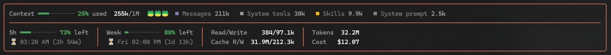

# claude-mods

Claude Code mods: plugins of function hooks that change what Claude Code shows and does.
Each mod lives in its own folder under `mods/`, and the repo is also a plugin marketplace, so any of them installs straight from here.

## Mods

| Mod | What it does |
| --- | --- |
| [cockpit](mods/cockpit) | A bordered band above the prompt: context fill and what takes it, 5-hour and weekly limits with reset times, token usage and cost. |
| [turn-memo](mods/turn-memo) | A one-line memo beneath every reply: tokens, read/write, cache read/write and running cost. |



## Install

Add the marketplace once, then install any mod from it:

```sh
claude plugin marketplace add Showrin/claude-mods
claude plugin install cockpit@claude-mods
```

Or from inside a Claude Code session:

```
/plugin marketplace add Showrin/claude-mods
/plugin install cockpit@claude-mods
```

The mod loads in your next session. To get new versions later:

```sh
claude plugin marketplace update claude-mods
claude plugin update cockpit@claude-mods
```

## Develop

Working from a clone, add the folder as the marketplace instead: Claude Code then reads each mod straight from it, so `/reload-plugins` picks up an edit with no reinstall.

```sh
claude plugin marketplace add ./claude-mods
claude plugin install cockpit@claude-mods
```

To try a mod for one session without installing it:

```sh
claude --plugin-dir mods/cockpit
```

## Adding a mod

1. Create `mods/<name>/` with `.claude-plugin/plugin.json`, `hooks/hooks.json` and `hooks/register.tsx`.
2. Add it to `plugins` in `.claude-plugin/marketplace.json` with `"source": "./mods/<name>"`.
3. Check it: `claude plugin validate mods/<name>` and `claude plugin test mods/<name>`.
